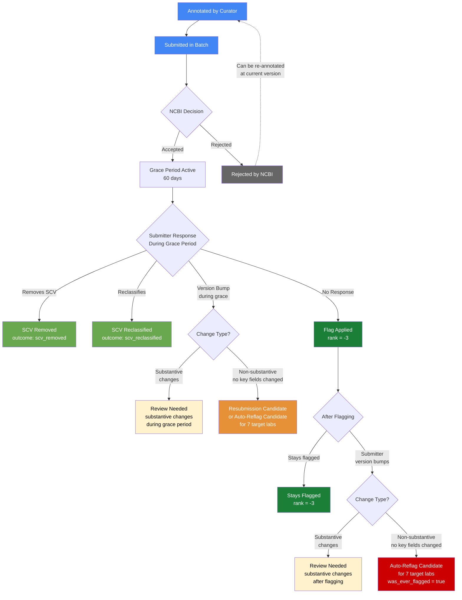

# CVC Submission Lifecycle: How Flagging Candidates Are Tracked and Managed

## Executive Summary

The ClinVar Curation (CVC) project improves ClinVar data quality by identifying SCV submissions (clinical assertions) that may be incorrect, outdated, or conflicting, and submitting flagging requests to ClinVar. This document describes the full lifecycle of those flagging requests — from the initial curator annotation through ClinVar's processing, the 60-day submitter grace period, and the eventual outcome.

The lifecycle has several possible paths. In the simplest case, a curator annotates an SCV as a "flagging candidate," it gets submitted to ClinVar in a batch, the submitter doesn't respond within 60 days, and the flag is applied. In practice, several things can intervene: submitters may respond by updating, reclassifying, or removing their SCV; ClinVar may reject the submission; the submitter may "version bump" (resubmit with no meaningful changes) to prevent or remove the flag; or the submitter may contact ClinVar during the grace period to dispute the flagging reason and request that their SCV remain as-is. Each of these scenarios is tracked and handled differently.

**Key concepts:**
- **Flagging candidate** — an SCV that CVC submits to ClinVar requesting it be flagged
- **Grace period** — 60 days from when ClinVar accepts the batch; submitter can respond before the flag is applied
- **Flagged submission** — an SCV with rank = -3, excluded from ClinVar's conflict calculations
- **Version bump** — a submitter resubmission with no substantive changes to the 6 key fields
- **Substantive fields** — `classif_type`, `submitted_classification`, `last_evaluated`, `trait_set_id`, `pmids`, `classification_comment`

---

## The Standard Lifecycle

```
                                                              Submitter
  Curator         Batch            ClinVar          Grace      Response      Flag
 Annotates       Submitted        Accepts          Period       Window      Applied
    |               |                |               |            |           |
    v               v                v               v            v           v
┌────────┐    ┌──────────┐    ┌───────────┐    ┌─────────┐    ┌───────┐    ┌───────┐
│Annotate│───>│ Finalize │───>│  Accepted │───>│ 60-day  │───>│ Flag  │───>│Flagged│
│  SCV   │    │  Batch   │    │  by NCBI  │    │  Grace  │    │Applied│    │rank=-3│
└────────┘    └──────────┘    └───────────┘    │  Period │    └───────┘    └───────┘
                                               └─────────┘
                                                    |
                                              Submitter may:
                                              - Remove SCV
                                              - Reclassify
                                              - Version bump
                                              - Do nothing
```

### Phase 1: Annotation

A curator reviews an SCV in the ClinVar Curation Chrome Extension and takes one of three actions:

| Action | Meaning | What happens next |
|--------|---------|-------------------|
| **Flagging Candidate** | This SCV has quality issues and should be flagged | Added to the next batch for submission to ClinVar |
| **No Change** | This SCV was reviewed and is acceptable | Recorded for tracking; no submission to ClinVar |
| **Remove Flagged Submission** | This SCV was previously flagged and the flag should be removed | Added to the next batch requesting flag removal |

Each annotation records:
- The SCV ID and version at the time of annotation
- The curator who made the annotation
- The action and reason (selected from the [Curation Criteria Guide](../CURATION_CRITERIA_GUIDE.md))
- The date and associated ClinVar release

### Phase 2: Batch Submission

Annotations are collected into batches and submitted to ClinVar periodically. Each batch:
- Is finalized with a timestamp
- Contains multiple SCV annotations across multiple variants
- Is submitted to ClinVar as a single file
- Receives an acceptance date when ClinVar processes it

The **batch acceptance date** is derived from the `batch_end_date` in `cvc_clinvar_batches` and marks the start of the 60-day grace period for all SCVs in that batch.

### Phase 3: Grace Period (60 Days)

Once ClinVar accepts the batch, each flagging candidate enters a **60-day grace period**. During this time:
- The submitter is notified that their SCV has been identified for potential flagging
- The submitter has the opportunity to update, reclassify, or remove their SCV
- ClinVar does not apply the flag during this period
- If the submitter takes no action, the flag is applied after 60 days

The grace period end date is calculated as: `batch_accepted_date + 60 days`

### Phase 4: Outcome

After the grace period, the SCV's outcome is determined based on its current state:

| Outcome | Condition | Meaning |
|---------|-----------|---------|
| **Flagged** | Current rank = -3 | ClinVar applied the flag; SCV is excluded from conflict calculations |
| **SCV Removed** | SCV no longer exists in current release | Submitter deleted the SCV (positive outcome) |
| **SCV Reclassified** | Classification type changed from submitted version | Submitter changed their classification (positive outcome) |
| **SCV Updated, Same Classification** | Version changed but classification type unchanged | Submitter resubmitted without changing classification (may be a version bump) |
| **Pending** | Same version, not flagged | Still awaiting ClinVar action or stuck |
| **Rejected** | SCV appears in rejected SCVs list | ClinVar rejected the submission |

---

## Scenario 1: First-Time Annotation — Standard Flag Application

**Situation:** An SCV has never been annotated before. A curator identifies it as a flagging candidate.

**What happens:**
1. Curator annotates the SCV as "flagging candidate" with a reason
2. Annotation is included in the next batch
3. Batch is submitted to ClinVar and accepted
4. 60-day grace period begins
5. Submitter takes no action
6. After 60 days, ClinVar applies the flag (rank = -3)
7. The SCV is excluded from ClinVar's conflict calculations

**Tracked as:** `outcome = 'flagged'` in `cvc_flagging_candidate_outcomes`

---

## Scenario 2: Annotation with Pending Prior Submissions

**Situation:** A curator annotates an SCV that already has one or more prior flagging candidate submissions "in flight."

An SCV can be "in flight" in two ways:
- **Annotated but not yet submitted** — the annotation exists but hasn't been included in a finalized batch
- **Submitted but still in the grace period** — the batch was accepted but the 60-day window hasn't closed

**What happens:**
- The system tracks all annotations per SCV across batches
- The `cvc_annotations_view` identifies the `is_latest` annotation per SCV per batch
- For auto-reflag analysis, only the **most recent** flagging candidate submission per SCV is considered (deduplicated by `batch_accepted_date DESC`)
- Prior submissions for the same SCV are not double-counted

**Why this matters:** If the same SCV was submitted in batch 103 and again in batch 107, only the batch 107 submission is used for resubmission or auto-reflag analysis. The earlier submission is considered historically superseded.

---

## Scenario 3: NCBI Rejects the Flagging Candidate

**Situation:** ClinVar (NCBI) rejects a flagging candidate submission during processing, before the grace period begins. This is an administrative rejection by ClinVar, not a submitter response.

**Common NCBI rejection reasons:**
- **Deleted SCV** — the SCV was removed before the submission was processed
- **Version mismatch** — the submitted SCV version no longer matches the current version (e.g., submitter updated between our annotation and NCBI's processing)
- **Duplicate submission** — the SCV was already submitted in a prior batch
- **Previously submitted flagging candidate** — the SCV was already flagged in a prior submission
- **Mistaken submission** — identified as an error by NCBI

**What happens:**
1. The rejection is recorded in `rejected-scvs.tsv` (manually maintained)
2. Rejected SCVs are loaded into `cvc_rejected_scvs`
3. All downstream analysis (flagging outcomes, resubmission candidates, auto-reflag) **excludes rejected SCVs**
4. The SCV can be re-annotated and submitted in a future batch if the rejection reason is resolved

**Tracked as:** Excluded from `cvc_flagging_candidate_outcomes` via LEFT JOIN filter

---

## Scenario 3a: Submitter Disputes the Flagging Reason

**Situation:** During the grace period, the submitter contacts ClinVar to dispute the flagging reason and requests that their SCV remain as-is. The submitter does not update, reclassify, or remove their SCV — they explicitly reject the rationale for flagging.

This is distinct from an NCBI rejection (Scenario 3) because:
- NCBI rejections are administrative (version mismatch, deleted SCV, etc.)
- Submitter disputes are clinical disagreements ("I stand by my assertion")

**What currently happens:**
1. ClinVar communicates the dispute to CVC
2. CVC records the rejection in `rejected-scvs.tsv`
3. The SCV is excluded from downstream analysis for that batch

**Open questions for future policy:**

There are two distinct submitter responses that should be handled differently:

| Submitter Response | Meaning | Should we re-curate? |
|--------------------|---------|---------------------|
| **"I reject this specific flagging reason"** | The submitter disagrees with the stated rationale but may be open to flagging for a different reason | Potentially yes — if a different flagging reason applies, or if the SCV changes substantively in the future, it could be re-curated under a new reason |
| **"Do not touch this SCV"** | The submitter categorically refuses any flagging action on this SCV | Generally no — unless the SCV is substantively updated by the submitter in the future, which may indicate a change in their position |

**Recommendation:** Both types of submitter disputes should be tracked with enough detail to distinguish them. The current `rejection_reason` field in `rejected-scvs.tsv` could capture this distinction (e.g., `submitter_rejects_reason` vs `submitter_do_not_touch`). Future curation of a disputed SCV should consider:

1. **If the SCV was substantively updated** after the dispute — the submitter changed their assertion, which may warrant fresh review regardless of the prior dispute
2. **If a different flagging reason applies** — a reason-specific rejection should not block curation under a different reason
3. **If the submitter categorically refused** — the SCV should generally be excluded from future curation unless circumstances change significantly

> **Note:** This tracking and policy is not yet fully implemented in the pipeline. Currently, submitter disputes are recorded as rejections in `rejected-scvs.tsv` without distinguishing them from NCBI administrative rejections or capturing the scope of the dispute (reason-specific vs categorical). This is an area for future enhancement.

---

## Scenario 4: Submitter Updates SCV During Grace Period

**Situation:** After the batch is accepted but before the 60-day grace period expires, the submitter resubmits their SCV with a new version.

This is one of the most important scenarios because it can prevent the flag from being applied.

**Two sub-scenarios:**

### 4a: Submitter Makes Substantive Changes

The submitter changes one or more of the 6 substantive fields:

| Field | Example of substantive change |
|-------|-------------------------------|
| `classif_type` | Changed from "Pathogenic" to "VUS" |
| `submitted_classification` | Updated the free-text classification |
| `last_evaluated` | Updated the evaluation date |
| `trait_set_id` | Changed the associated condition |
| `pmids` | Added or removed PubMed citations |
| `classification_comment` | Updated the evidence summary text |

**What happens:**
- The version increments and the old version is closed out
- ClinVar may or may not apply the flag (depends on timing and whether the change addresses the issue)
- If the classification type changed: `outcome = 'scv_reclassified'`
- If only non-classification fields changed: `outcome = 'scv_updated_same_classification'`
- The SCV appears in **resubmission candidates** if the flag was never applied, but is marked as `was_reclassified = TRUE` requiring manual review

### 4b: Submitter Version Bumps (Non-Substantive)

The submitter resubmits with **no changes** to any of the 6 substantive fields. The version increments but the clinical assertion is unchanged.

**What happens:**
- The version bump can reset or prevent the grace period flag from being applied
- ClinVar may treat the resubmission as a "response" and not apply the flag
- The SCV is tracked as `outcome = 'scv_updated_same_classification'`
- This is the pattern the **auto-reflag analysis** is designed to detect
- If the SCV belongs to one of the 7 target labs and all 6 fields are unchanged, it qualifies for automatic re-flagging

**Tracked as:** `is_version_bump = TRUE` in `cvc_version_bumps`, `was_ever_flagged = FALSE` in auto-reflag candidates

---

## Scenario 5: Submitter Updates SCV After Flag Was Applied

**Situation:** The flag was successfully applied (rank = -3), and then the submitter resubmits a new version.

**What happens:**
- The new version appears with a rank other than -3 (the flag is removed)
- If the submitter made substantive changes, the resubmission may have addressed the issue
- If the submitter version-bumped with no substantive changes, the flag was removed without addressing the issue

**Two sub-scenarios mirror Scenario 4:**

### 5a: Substantive Changes After Flagging

The submitter changed classification, evidence, condition, or citations after being flagged. This may indicate the submitter addressed the flagging reason.

**Tracked as:** `was_ever_flagged = TRUE` + `changes_detected != 'no_changes'` in auto-reflag candidates. Marked as "Review Needed" — a curator should check whether the change addresses the original reason.

### 5b: Non-Substantive Version Bump After Flagging

The submitter resubmitted with no changes to the 6 substantive fields, effectively removing the flag without addressing the issue.

**Tracked as:** `was_ever_flagged = TRUE` + `is_autoreflag_candidate = TRUE`. This is a prime candidate for automatic re-flagging.

---

## Scenario 6: Re-Annotating a Previously Rejected SCV

**Situation:** An SCV was previously submitted as a flagging candidate, ClinVar rejected it (e.g., version mismatch), and now a curator wants to re-annotate it.

**What happens:**
1. The curator creates a new annotation for the SCV at its current version
2. The new annotation is included in the next batch
3. The rejection history is preserved in `cvc_rejected_scvs` but does not block the new submission
4. The new submission follows the standard lifecycle (grace period → outcome)
5. Only the most recent annotation per SCV is considered for auto-reflag analysis

**Key point:** Rejections are not permanent blocks. They're a record of what happened to a specific batch submission. A new annotation at the current version is a fresh submission.

---

## Scenario 7: Removing a Flag (Remove Flagged Submission)

**Situation:** A curator determines that a previously applied flag should be removed. Reasons include:
- Other valid SCVs were submitted for the same variant
- The gene-disease relationship classification changed
- Discussion with the submitter resolved the issue
- The original flagging was a curation error

**What happens:**
1. Curator annotates the SCV with action "remove flagged submission" and a reason
2. Annotation is submitted in the next batch
3. ClinVar processes the removal request

**Current status:** As of the data available, none of these removal requests have been successfully applied by ClinVar (all show `outcome = 'still_flagged'`). This is tracked in `cvc_remove_flagged_outcomes`.

**Impact on auto-reflag:** If a "remove flagged submission" was accepted **after** the most recent flagging candidate submission for the same SCV, that SCV is **excluded** from auto-reflag candidates. This prevents re-flagging an SCV where CVC explicitly requested flag removal.

---

## Scenario 8: The Auto-Reflag Process

**Situation:** An SCV was submitted as a flagging candidate, the submitter version-bumped without substantive changes, and the SCV is currently not flagged. This applies to 7 target labs only.

**Eligibility criteria (all must be true):**
1. SCV was submitted as a flagging candidate (not rejected)
2. Only the most recent flagging candidate submission per SCV is considered
3. No "remove flagged submission" was accepted after the flagging candidate
4. SCV is currently not flagged (rank != -3) and not removed
5. Version changed since the flagging candidate was submitted
6. All 6 substantive fields are unchanged between submitted and current version
7. SCV belongs to one of the 7 target labs: LabCorp Genetics, CeGaT, Revvity, OMIM, Baylor Genetics, Counsyl, Eurofins

**What happens:**
1. The auto-reflag analysis identifies eligible SCVs
2. Curators review the list in the Auto-Reflag Tracking Google Sheet
3. Approved SCVs are added to the Resubmission Queue
4. The queue is exported and submitted to ClinVar as a new batch
5. The new submission enters the standard lifecycle (grace period → outcome)

**Two categories in the auto-reflag list:**
- **Auto-Reflag** (green): All 6 fields unchanged — ready for automatic resubmission
- **Review Needed** (yellow): At least one field changed — requires manual assessment

---

## Scenario 9: NCBI-Originated Flags (Not ClinGen)

**Situation:** An SCV has rank = -3 (flagged), but the flag was not originated by ClinGen/CVC. NCBI can flag SCVs through their own internal processes, independent of ClinGen's curation workflow.

**Why this matters:**

ClinGen curators encounter flagged SCVs in two contexts:

1. **During curation review** — a curator may see an SCV that is already flagged and not realize it was flagged by NCBI rather than ClinGen
2. **During "remove flagged submission" workflows** — a curator may accidentally submit a removal request for an NCBI-originated flag, which ClinGen did not submit and should not be managing

**Current risk:** The curation tools do not currently distinguish between ClinGen-originated and NCBI-originated flags. A curator could inadvertently submit a "remove flagged submission" for a flag that ClinGen never placed, potentially undermining NCBI's own quality control.

**Recommended approach:**

| Concern | Recommendation |
|---------|----------------|
| Identifying NCBI-originated flags | Compare flagged SCVs (rank = -3) against `cvc_flagging_candidate_outcomes` — any flagged SCV NOT in the CVC submission history was flagged by NCBI or another party |
| Preventing accidental removal | The curation extension or review process should warn curators when an SCV's flag was not originated by ClinGen |
| Curation of NCBI-flagged SCVs | ClinGen should generally not curate (annotate as "no change" or "flagging candidate") SCVs that NCBI has independently flagged, unless there is a specific ClinGen reason to do so |

**Multi-group coordination (ClinGen CVC + CNV groups):**

As ClinGen expands curation to include a CNV-focused group, additional coordination is needed:

| Scenario | Risk | Mitigation |
|----------|------|------------|
| Both groups curate the same SCV | Duplicate or conflicting submissions | Shared annotation system should show prior annotations from both groups |
| One group flags, the other removes | Group A flags an SCV, Group B independently submits a "remove flagged submission" | Each group should check annotation history before removing flags; remove requests should only be submitted by the group that originated the flag |
| NCBI flag mistaken for ClinGen flag | Either group submits a removal for an NCBI-originated flag | Flag origin attribution needed — cross-reference against CVC submission history |

> **Note:** This multi-group coordination and NCBI flag attribution is not yet implemented in the pipeline or curation tools. This is an area for future enhancement as the CNV curation group becomes active.

---

## Substantive vs Non-Substantive Changes

A **substantive change** means the submitter modified at least one of the 6 key fields that reflect their clinical assertion. A **non-substantive change** (version bump) means the version incremented but none of these fields changed.

### The 6 Substantive Fields

| Field | What it represents | Why it matters |
|-------|--------------------|----------------|
| `classif_type` | Classification category (Pathogenic, VUS, etc.) | The core clinical assertion |
| `submitted_classification` | Free-text classification the submitter provides | Detailed assertion text |
| `last_evaluated` | Date the submitter last evaluated the variant | Indicates recency of review |
| `trait_set_id` | The condition/disease associated with the assertion | Changes the clinical context |
| `pmids` | Ordered list of PubMed citation IDs | Reflects the evidence base |
| `classification_comment` | Evidence summary / interpretation text | Detailed reasoning |

### The Other 14 Fields (Compared in Full-Record Analysis)

The full-record analysis compares all 20 fields to detect **duplicate bumps** (completely identical resubmissions). The additional 14 fields not in the substantive check include:

| Field | Why excluded from substantive check |
|-------|-------------------------------------|
| `statement_type` | Structural — type of clinical statement |
| `original_proposition_type` | Structural — GA4GH proposition type |
| `gks_proposition_type` | Structural — GA4GH proposition type |
| `clinical_impact_assertion_type` | Clinical impact specific |
| `clinical_impact_clinical_significance` | Clinical impact specific |
| `rank` | Changes when flag is applied/removed — not a submitter action |
| `review_status` | Can change due to ClinVar processing, not submitter |
| `local_key` | Submitter's internal identifier |
| `clinsig_type` | Derived from classification |
| `classification_label` | Display label (derived) |
| `classification_abbrev` | Abbreviated label (derived) |
| `origin` | Sample origin (germline, somatic) |
| `affected_status` | Patient affected status |
| `method_type` | Testing method |

---

## Lifecycle State Diagram



---

## Data Pipeline Summary

The lifecycle is tracked across these pipeline steps, which should be re-run after each ClinVar release:

| Step | Script | What it produces |
|------|--------|------------------|
| Load | `load-rejected-scvs.sh` | Rejection records (batch acceptance dates are derived from `cvc_clinvar_batches`) |
| 00 | `00-cvc-batch-enriched-view.sql` | Grace period dates for each batch |
| 04 | `04-flagging-candidate-outcomes.sql` | Outcome for every flagging candidate + remove-flag submission |
| 05 | `05-version-bump-detection.sql` | Version bump detection (6-field substantive check) |
| 06 | `06-version-bump-flagging-intersection.sql` | Which flagging candidates had version bumps |
| 07 | `07-resubmission-candidates.sql` | SCVs needing resubmission (all labs) |
| 08 | `08-autoreflag-candidates.sql` | Auto-reflag candidates (7 target labs) |

See [GOOGLE-SHEETS-SETUP.md](GOOGLE-SHEETS-SETUP.md) for the "Keeping Data Current" section with full re-run instructions.

---

## Glossary

| Term | Definition |
|------|------------|
| **SCV** | Submission Accession — a unique identifier for each submission to ClinVar (e.g., SCV000123456) |
| **VCV** | Variant Accession — the ClinVar identifier for a variant that may have multiple submissions |
| **Flagging Candidate** | An SCV that CVC submits to ClinVar requesting it be flagged |
| **Flagged Submission** | An SCV with rank = -3, excluded from ClinVar's conflict calculations |
| **Grace Period** | 60 days from batch acceptance; submitter can respond before flag is applied |
| **Version Bump** | Submitter resubmits with no substantive changes to the 6 key fields |
| **Substantive Change** | A change to one or more of: classif_type, submitted_classification, last_evaluated, trait_set_id, pmids, classification_comment |
| **Duplicate Bump** | A resubmission where ALL 20 comparable fields are identical (strictest form of version bump) |
| **Batch** | A collection of annotations submitted to ClinVar together |
| **Annotation** | A curator's recorded action on an SCV (flag, no change, or remove flag) |
| **Auto-Reflag** | Automatically re-submitting a flagging candidate for SCVs that were version-bumped without substantive changes |
| **Target Labs** | The 7 labs approved for auto-reflagging: LabCorp, CeGaT, Revvity, OMIM, Baylor Genetics, Counsyl, Eurofins |

---

## Related Documentation

- [Curation Criteria Guide](../CURATION_CRITERIA_GUIDE.md) — When and how to use each annotation action and reason
- [CVC Impact Analysis README](README.md) — Pipeline architecture and conflict resolution attribution
- [Google Sheets Dashboard Setup](GOOGLE-SHEETS-SETUP.md) — Chart setup, data freshness, and pipeline re-run instructions
- [Resubmission Tracking Guide](RESUBMISSION-TRACKING-GUIDE.md) — Google Sheet workflow for resubmission candidates
- [Auto-Reflag Tracking Guide](AUTOREFLAG-TRACKING-GUIDE.md) — Google Sheet workflow for auto-reflag candidates

---

## Version History

| Date | Version | Changes |
|------|---------|---------|
| 2026-07-09 | 1.0 | Initial version |
